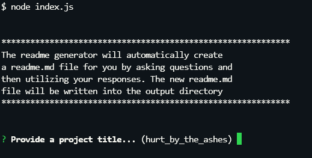
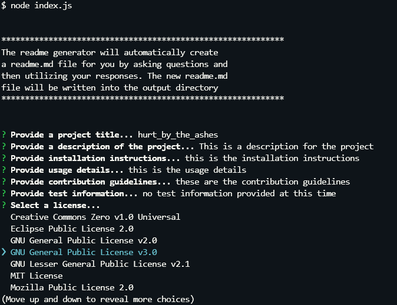
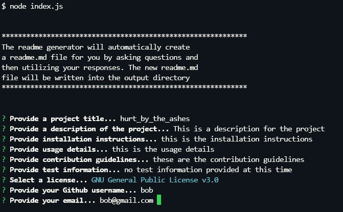
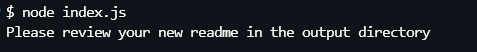
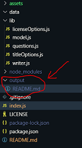
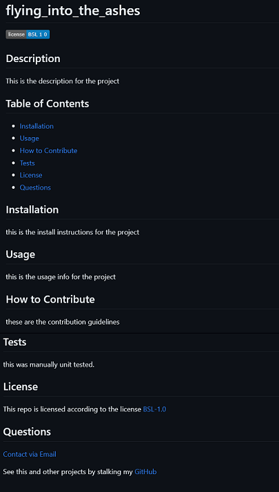

# readme_generator

## Description

A README.md file generator built on node.js. This program will
generate a new README.md file in an output directory with values
that a user enters at run-time.

## Table of Contents

- [General Functionality](#general-functionality)
- [Screenshots](#screen-shots)
- [Installation](#installation)
- [Usage](#usage)
- [Credits](#credits)
- [License](#licensing)
- [Contributing](#contributing)

### General Functionality

The program will ask a user questions that are needed to fulfill
the requirements of generating a unique and complete README.md file.

- Suggested Title:

  Copying from GitHub, a random title is generated for the user and they may choose to use it or not. The title comes from a [book title generator](https://story-shack-cdn-v2.glitch.me/generators/book-title-generator?count=10) API.

- Required Responses:

  A Github user name is required
  A `valid` email address is required

- Optional Responses:

  All other responses to questions are optional. Any responses not
  entered will have a TODO: added to the applicable section as a placeholder.

- License Selection:

  The [Github API](https://api.github.com/licenses) is used to populate the license options available.

### Screen Shots

#### Initial Launch from Command Line

#### License Menu Options

#### All the Q&A Complete

#### Final Completion Message

#### Output Location

#### The Generated README.md

### Installation

1.  Install Node.js version 20.x or newer
2.  Clone https://github.com/ericroys-school/readme_generator.git
3.  `cd` into the `readme_generator` directory
4.  Run `npm i` to load all the project dependencies
5.  Run the program via `node index.js`

### Usage

As mentioned in the installation instructions, you run the program with `node index.js`. This will launch an interactive question and answer session. Once the Q&A is complete a README.md file is created in the output directory.

You can watch a quick [video](https://drive.google.com/file/d/1HS-gsmMzTKEV4Utv9PMGEHEauATYKBZe/view) on how the process works if you are not satisfied with the screenshots provided.

### Credits

No kittens, puppies, armadillos, otter, or octopi were harmed in the making of this project.

### Licensing

As per always, this repo is licensed with [The Unlicense](http://choosealicense.com/licenses/unlicense) so feel free to do whatever. Share with your kids, dogs, neighbors, mail carrier, etc. Have a nice day!

### Contributing

Feel free to reach out via email @ eric.roys@gmail.com if you are interested in contributions to the project or have any kindly suggestions for improvements and/or enhancements. Tanks, Sherman!
